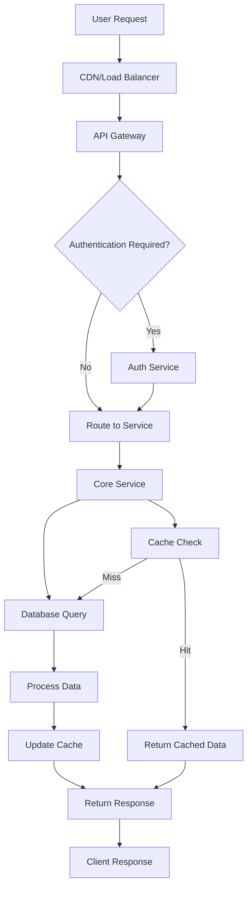
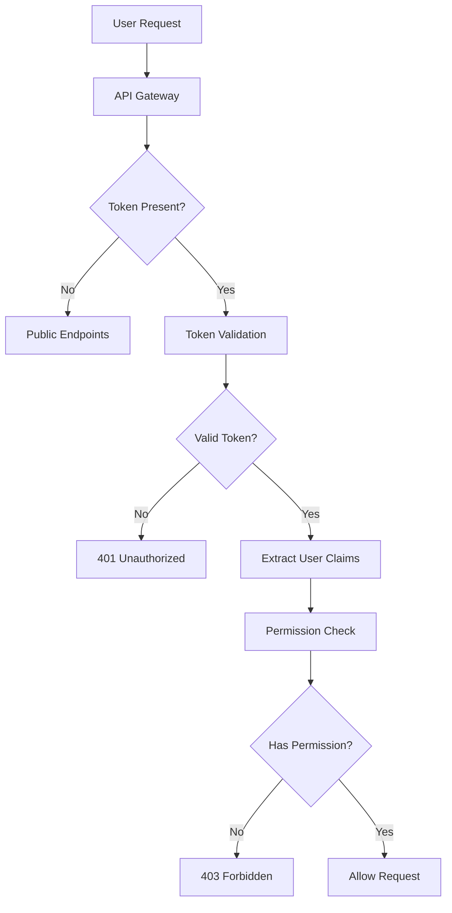
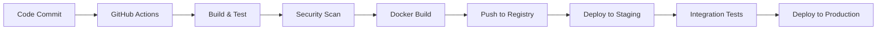

# 🏗️ SarkariBot System Architecture

## Overview

SarkariBot is a sophisticated, full-stack government job portal designed for zero-touch content management through intelligent web scraping, automated content generation, and AI-powered SEO optimization. The system follows modern microservices principles with clear separation of concerns and scalable architecture patterns.

## 🎯 Architecture Goals

### Primary Objectives
- **Zero-Touch Operations**: Fully automated content lifecycle management
- **High Availability**: 99.9% uptime with automatic failover
- **Scalability**: Handle 1M+ concurrent users and 10K+ jobs
- **Performance**: Sub-second page loads and real-time updates
- **Reliability**: Fault-tolerant with comprehensive monitoring
- **Security**: Enterprise-grade security and data protection

### Design Principles
- **Microservices Architecture**: Loosely coupled, independently deployable services
- **Event-Driven Design**: Asynchronous processing and real-time updates
- **API-First Approach**: RESTful APIs for all inter-service communication
- **Domain-Driven Design**: Clear business domain boundaries
- **CQRS Pattern**: Separate read and write operations for optimal performance
- **Cloud-Native**: Container-ready with 12-factor app principles

## 🏛️ High-Level Architecture

```
┌─────────────────────────────────────────────────────────────────┐
│                        SarkariBot System                       │
├─────────────────────────────────────────────────────────────────┤
│                                                                 │
│  ┌─────────────┐  ┌─────────────┐  ┌─────────────┐             │
│  │   Frontend  │  │    Admin    │  │   Mobile    │             │
│  │  React SPA  │  │  Dashboard  │  │     App     │             │
│  └─────────────┘  └─────────────┘  └─────────────┘             │
│         │                 │                 │                  │
│         └─────────────────┼─────────────────┘                  │
│                           │                                    │
│  ┌─────────────────────────┼─────────────────────────────────┐  │
│  │                    Load Balancer / CDN                   │  │
│  │                   (Nginx / CloudFlare)                   │  │
│  └─────────────────────────┼─────────────────────────────────┘  │
│                           │                                    │
│  ┌─────────────────────────┼─────────────────────────────────┐  │
│  │                   API Gateway                            │  │
│  │              (Authentication & Routing)                  │  │
│  └─────────────────────────┼─────────────────────────────────┘  │
│                           │                                    │
│  ┌─────────────────────────┼─────────────────────────────────┐  │
│  │                Core Application Layer                    │  │
│  │                                                           │  │
│  │  ┌─────────────┐  ┌─────────────┐  ┌─────────────┐      │  │
│  │  │    Jobs     │  │  Scraping   │  │     SEO     │      │  │
│  │  │   Service   │  │   Service   │  │   Service   │      │  │
│  │  └─────────────┘  └─────────────┘  └─────────────┘      │  │
│  │                                                           │  │
│  │  ┌─────────────┐  ┌─────────────┐  ┌─────────────┐      │  │
│  │  │    User     │  │    Cache    │  │   Search    │      │  │
│  │  │   Service   │  │   Service   │  │   Service   │      │  │
│  │  └─────────────┘  └─────────────┘  └─────────────┘      │  │
│  └─────────────────────────┼─────────────────────────────────┘  │
│                           │                                    │
│  ┌─────────────────────────┼─────────────────────────────────┐  │
│  │                 Message Queue Layer                      │  │
│  │                    (Redis / Celery)                      │  │
│  └─────────────────────────┼─────────────────────────────────┘  │
│                           │                                    │
│  ┌─────────────────────────┼─────────────────────────────────┐  │
│  │                   Data Layer                             │  │
│  │                                                           │  │
│  │  ┌─────────────┐  ┌─────────────┐  ┌─────────────┐      │  │
│  │  │ PostgreSQL  │  │    Redis    │  │ Elasticsearch│      │  │
│  │  │  (Primary)  │  │   (Cache)   │  │   (Search)   │      │  │
│  │  └─────────────┘  └─────────────┘  └─────────────┘      │  │
│  └─────────────────────────┼─────────────────────────────────┘  │
│                           │                                    │
│  ┌─────────────────────────┼─────────────────────────────────┐  │
│  │               External Services Layer                    │  │
│  │                                                           │  │
│  │  ┌─────────────┐  ┌─────────────┐  ┌─────────────┐      │  │
│  │  │   Storage   │  │ Monitoring  │  │   Email &   │      │  │
│  │  │ (AWS S3 /   │  │  (Sentry/   │  │     SMS     │      │  │
│  │  │ CloudFlare) │  │ Prometheus) │  │  Services   │      │  │
│  │  └─────────────┘  └─────────────┘  └─────────────┘      │  │
│  └─────────────────────────────────────────────────────────┘  │
│                                                                 │
└─────────────────────────────────────────────────────────────────┘
```

## 🧩 Component Architecture

### Frontend Layer

#### React Single Page Application
```typescript
// Architecture Structure
src/
├── components/           # Reusable UI components
│   ├── common/          # Generic components (Button, Modal, etc.)
│   ├── job/             # Job-specific components
│   ├── search/          # Search-related components
│   └── layout/          # Layout components
├── pages/               # Route-level components
├── services/            # API communication layer
├── store/               # Redux store configuration
├── hooks/               # Custom React hooks
├── utils/               # Utility functions
├── types/               # TypeScript type definitions
└── styles/              # Global styles and themes
```

**Key Features**:
- Server-Side Rendering (SSR) for SEO optimization
- Progressive Web App (PWA) capabilities
- Responsive design with mobile-first approach
- Real-time updates via WebSocket connections
- Advanced caching strategies for performance

**Technology Stack**:
- **Framework**: React 18 with TypeScript
- **State Management**: Redux Toolkit + RTK Query
- **Routing**: React Router v6
- **Styling**: Styled-components + Material-UI
- **Build Tool**: Vite for fast development
- **Testing**: Jest + React Testing Library

### Backend Layer

#### Core Django Application
```python
# Backend Architecture Structure
backend/
├── config/              # Project configuration
│   ├── settings/        # Environment-specific settings
│   ├── urls.py         # URL routing
│   └── wsgi.py         # WSGI configuration
├── apps/                # Django applications
│   ├── jobs/           # Job management
│   ├── sources/        # Source management
│   ├── scraping/       # Web scraping logic
│   ├── search/         # Search functionality
│   ├── seo/            # SEO automation
│   ├── users/          # User management
│   └── analytics/      # Analytics and tracking
├── common/              # Shared utilities
├── api/                # API layer (DRF)
├── tasks/              # Celery tasks
└── tests/              # Test suites
```

**Key Features**:
- RESTful API with Django REST Framework
- Automated background processing with Celery
- Comprehensive caching strategies
- Real-time capabilities with Django Channels
- Robust authentication and authorization
- Automated testing and code quality checks

**Technology Stack**:
- **Framework**: Django 5.2 + Django REST Framework
- **Database ORM**: Django ORM with PostgreSQL
- **Task Queue**: Celery with Redis broker
- **WebSockets**: Django Channels
- **API Documentation**: drf-spectacular (OpenAPI 3.0)
- **Testing**: pytest + factory_boy

## 🔄 Data Flow Architecture

### Request Processing Flow



### Job Processing Workflow

```mermaid
graph LR
    A[Scraping Trigger] --> B[Source Selection]
    B --> C[Data Extraction]
    C --> D[Data Validation]
    D --> E[Duplicate Detection]
    E --> F[Content Processing]
    F --> G[SEO Optimization]
    G --> H[Database Storage]
    H --> I[Cache Invalidation]
    I --> J[Search Index Update]
    J --> K[Notification Dispatch]
```



## 🗃️ Data Architecture

### Database Design

#### Primary Database (PostgreSQL)
```sql
-- Core entity relationships
┌─────────────────┐    ┌─────────────────┐    ┌─────────────────┐
│    Categories   │    │   JobPostings   │    │     Sources     │
├─────────────────┤    ├─────────────────┤    ├─────────────────┤
│ id (PK)         │◄──┤ category_id (FK)│    │ id (PK)         │
│ name            │    │ source_id (FK)  ├───►│ name            │
│ slug            │    │ title           │    │ base_url        │
│ description     │    │ description     │    │ active          │
│ position        │    │ status          │    │ last_scraped    │
│ created_at      │    │ department      │    │ created_at      │
│ updated_at      │    │ total_posts     │    │ updated_at      │
└─────────────────┘    │ qualification   │    └─────────────────┘
                       │ notification_date│
                       │ application_date │
                       │ exam_date       │
                       │ result_date     │
                       │ application_link│
                       │ salary_min      │
                       │ salary_max      │
                       │ age_min         │
                       │ age_max         │
                       │ application_fee │
                       │ is_featured     │
                       │ priority        │
                       │ view_count      │
                       │ apply_count     │
                       │ seo_metadata    │
                       │ created_at      │
                       │ updated_at      │
                       └─────────────────┘
```

#### Cache Layer (Redis)
```redis
# Cache Key Patterns
jobs:list:{filters_hash}            # Job listings with filters
jobs:detail:{job_id}                # Individual job details
jobs:trending                       # Trending jobs
categories:list                     # Category list
sources:list                        # Source list
search:results:{query_hash}         # Search results
stats:dashboard                     # Dashboard statistics
user:session:{user_id}              # User session data
scraping:status:{source_id}         # Scraping status
```

#### Search Index (Elasticsearch)
```json
{
  "mappings": {
    "properties": {
      "id": {"type": "keyword"},
      "title": {
        "type": "text",
        "analyzer": "standard",
        "fields": {
          "keyword": {"type": "keyword"}
        }
      },
      "description": {
        "type": "text",
        "analyzer": "standard"
      },
      "category": {
        "type": "nested",
        "properties": {
          "name": {"type": "keyword"},
          "slug": {"type": "keyword"}
        }
      },
      "source": {
        "type": "nested",
        "properties": {
          "name": {"type": "keyword"},
          "display_name": {"type": "text"}
        }
      },
      "status": {"type": "keyword"},
      "department": {"type": "keyword"},
      "qualification": {"type": "keyword"},
      "location": {"type": "geo_point"},
      "salary_range": {"type": "integer_range"},
      "age_range": {"type": "integer_range"},
      "dates": {
        "properties": {
          "notification": {"type": "date"},
          "application_end": {"type": "date"},
          "exam": {"type": "date"}
        }
      },
      "popularity": {
        "properties": {
          "view_count": {"type": "integer"},
          "apply_count": {"type": "integer"},
          "trend_score": {"type": "float"}
        }
      },
      "created_at": {"type": "date"},
      "updated_at": {"type": "date"}
    }
  }
}
```

## 🔧 Service Architecture

### Microservices Breakdown

#### 1. Job Management Service
**Responsibilities**:
- CRUD operations for job postings
- Job status lifecycle management
- Data validation and normalization
- Duplicate detection and merging

**API Endpoints**:
```
GET    /api/v1/jobs/                    # List jobs
POST   /api/v1/jobs/                    # Create job
GET    /api/v1/jobs/{id}/               # Get job details
PUT    /api/v1/jobs/{id}/               # Update job
DELETE /api/v1/jobs/{id}/               # Delete job
GET    /api/v1/jobs/{id}/stats/         # Job statistics
POST   /api/v1/jobs/bulk/               # Bulk operations
```

#### 2. Web Scraping Service
**Responsibilities**:
- Automated data collection from government sources
- Intelligent parsing and extraction
- Content validation and quality control
- Error handling and retry mechanisms

**Architecture**:
```python
class ScrapingEngine:
    def __init__(self):
        self.extractors = {
            'ssc': SSCExtractor(),
            'upsc': UPSCExtractor(),
            'ibps': IBPSExtractor(),
            'railway': RailwayExtractor(),
            'defense': DefenseExtractor()
        }
        
    def scrape_source(self, source_config):
        extractor = self.extractors[source_config.name]
        return extractor.extract(source_config.urls)
```

**Key Features**:
- Multi-engine scraping architecture
- Intelligent content detection
- Anti-bot bypass mechanisms
- Rate limiting and respectful crawling
- Distributed scraping across multiple instances

#### 3. Search Service
**Responsibilities**:
- Full-text search across job content
- Advanced filtering and faceted search
- Auto-complete and suggestions
- Search analytics and optimization

**Search Architecture**:
```python
class SearchService:
    def __init__(self):
        self.elasticsearch = ElasticsearchClient()
        self.query_builder = QueryBuilder()
        self.analyzer = SearchAnalyzer()
        
    def search(self, query, filters=None):
        es_query = self.query_builder.build(query, filters)
        results = self.elasticsearch.search(es_query)
        return self.analyzer.analyze_and_format(results)
```

#### 4. SEO Automation Service
**Responsibilities**:
- Automated meta tag generation
- Content optimization for search engines
- Structured data markup
- Sitemap generation and management

**SEO Features**:
- AI-powered title and description generation
- Keyword density optimization
- Schema.org markup automation
- Social media meta tags
- Canonical URL management

#### 5. User Management Service
**Responsibilities**:
- User authentication and authorization
- Profile management
- Subscription and notification preferences
- Activity tracking and analytics

#### 6. Notification Service
**Responsibilities**:
- Email and SMS notifications
- Push notifications for mobile app
- Job alert management
- Newsletter distribution

## 🔒 Security Architecture

### Authentication & Authorization



### Security Measures

#### API Security
- JWT-based authentication with refresh tokens
- Rate limiting per user and IP
- Request validation and sanitization
- SQL injection prevention
- XSS protection with content security policy

#### Data Security
- Encryption at rest and in transit
- Database connection encryption
- Sensitive data masking in logs
- Regular security audits and penetration testing

#### Infrastructure Security
- VPC isolation and network segmentation
- WAF (Web Application Firewall) protection
- DDoS protection and mitigation
- Regular security patches and updates

## 📊 Performance Architecture

### Caching Strategy

#### Multi-Level Caching
```
┌─────────────────┐
│   Browser Cache │ (1 hour - 1 day)
└─────────────────┘
         │
┌─────────────────┐
│   CDN Cache     │ (1 hour - 1 week)
└─────────────────┘
         │
┌─────────────────┐
│ Application     │ (5 minutes - 1 hour)
│ Cache (Redis)   │
└─────────────────┘
         │
┌─────────────────┐
│ Database Query  │ (Real-time)
│ Result Cache    │
└─────────────────┘
```

#### Cache Invalidation Strategy
- Time-based expiration for static content
- Event-driven invalidation for dynamic data
- Cache warming for frequently accessed data
- Gradual cache refresh to prevent thundering herd

### Database Optimization

#### Read/Write Separation
```
┌─────────────────┐    ┌─────────────────┐
│  Write Master   │───►│   Read Replica  │
│   (Primary)     │    │   (Secondary)   │
└─────────────────┘    └─────────────────┘
         │                       │
         │              ┌─────────────────┐
         │              │   Read Replica  │
         │              │   (Secondary)   │
         │              └─────────────────┘
         │
┌─────────────────────────────────────────────┐
│            Load Balancer                    │
│         (Read Query Distribution)           │
└─────────────────────────────────────────────┘
```

#### Query Optimization
- Database indexing strategy
- Query optimization and monitoring
- Connection pooling
- Prepared statements for common queries

## 🚀 Scalability Architecture

### Horizontal Scaling

#### Auto-Scaling Configuration
```yaml
# Kubernetes HPA configuration
apiVersion: autoscaling/v2
kind: HorizontalPodAutoscaler
metadata:
  name: sarkaribot-backend-hpa
spec:
  scaleTargetRef:
    apiVersion: apps/v1
    kind: Deployment
    name: sarkaribot-backend
  minReplicas: 3
  maxReplicas: 20
  metrics:
  - type: Resource
    resource:
      name: cpu
      target:
        type: Utilization
        averageUtilization: 70
  - type: Resource
    resource:
      name: memory
      target:
        type: Utilization
        averageUtilization: 80
```

#### Load Balancing Strategy
- Round-robin distribution for API requests
- Sticky sessions for WebSocket connections
- Health check-based routing
- Circuit breaker pattern for service resilience

### Vertical Scaling

#### Resource Allocation
```yaml
resources:
  requests:
    memory: "512Mi"
    cpu: "250m"
  limits:
    memory: "2Gi"
    cpu: "1000m"
```

## 📈 Monitoring Architecture

### Observability Stack

#### Metrics Collection (Prometheus)
```yaml
# Prometheus configuration
global:
  scrape_interval: 15s
  evaluation_interval: 15s

scrape_configs:
  - job_name: 'sarkaribot-backend'
    static_configs:
      - targets: ['backend:8000']
    metrics_path: '/metrics'
    scrape_interval: 30s

  - job_name: 'postgres-exporter'
    static_configs:
      - targets: ['postgres-exporter:9187']

  - job_name: 'redis-exporter'
    static_configs:
      - targets: ['redis-exporter:9121']
```

#### Logging Strategy
```python
# Structured logging configuration
LOGGING = {
    'version': 1,
    'disable_existing_loggers': False,
    'formatters': {
        'json': {
            'class': 'pythonjsonlogger.jsonlogger.JsonFormatter',
            'format': '%(asctime)s %(name)s %(levelname)s %(message)s'
        }
    },
    'handlers': {
        'stdout': {
            'class': 'logging.StreamHandler',
            'formatter': 'json',
            'stream': 'ext://sys.stdout'
        },
        'file': {
            'class': 'logging.handlers.RotatingFileHandler',
            'filename': '/var/log/sarkaribot/app.log',
            'maxBytes': 100 * 1024 * 1024,  # 100MB
            'backupCount': 5,
            'formatter': 'json'
        }
    },
    'root': {
        'level': 'INFO',
        'handlers': ['stdout', 'file']
    }
}
```

#### Alerting Rules
```yaml
# Prometheus alerting rules
groups:
  - name: sarkaribot.rules
    rules:
      - alert: HighErrorRate
        expr: rate(django_http_responses_total{status=~"5.."}[5m]) > 0.05
        for: 5m
        labels:
          severity: critical
        annotations:
          summary: High error rate detected
          
      - alert: DatabaseConnectionsHigh
        expr: postgresql_active_connections > 80
        for: 2m
        labels:
          severity: warning
        annotations:
          summary: High database connection usage
```

## 🔄 Deployment Architecture

### CI/CD Pipeline



### Container Orchestration

#### Docker Architecture
```dockerfile
# Multi-stage build for optimization
FROM python:3.11-slim as base
# Install system dependencies
RUN apt-get update && apt-get install -y --no-install-recommends \
    postgresql-client \
    && rm -rf /var/lib/apt/lists/*

FROM base as dependencies
# Install Python dependencies
COPY requirements.txt .
RUN pip install --user -r requirements.txt

FROM base as runtime
# Copy dependencies and application
COPY --from=dependencies /root/.local /root/.local
COPY . /app
WORKDIR /app

# Health check
HEALTHCHECK --interval=30s --timeout=10s --start-period=60s --retries=3 \
    CMD curl -f http://localhost:8000/health/ || exit 1

EXPOSE 8000
CMD ["gunicorn", "config.wsgi:application"]
```

#### Kubernetes Deployment
```yaml
apiVersion: apps/v1
kind: Deployment
metadata:
  name: sarkaribot-backend
spec:
  replicas: 3
  selector:
    matchLabels:
      app: sarkaribot-backend
  template:
    metadata:
      labels:
        app: sarkaribot-backend
    spec:
      containers:
      - name: backend
        image: sarkaribot/backend:latest
        ports:
        - containerPort: 8000
        resources:
          requests:
            memory: "512Mi"
            cpu: "250m"
          limits:
            memory: "2Gi"
            cpu: "1000m"
        livenessProbe:
          httpGet:
            path: /health/
            port: 8000
          initialDelaySeconds: 60
          periodSeconds: 30
        readinessProbe:
          httpGet:
            path: /ready/
            port: 8000
          initialDelaySeconds: 30
          periodSeconds: 10
```

## 🌐 Content Delivery Architecture

### CDN Strategy

#### Multi-CDN Setup
```
┌─────────────────┐    ┌─────────────────┐
│   Primary CDN   │    │   Backup CDN    │
│  (CloudFlare)   │    │     (AWS)       │
└─────────────────┘    └─────────────────┘
         │                       │
         └───────────┬───────────┘
                     │
              ┌─────────────────┐
              │   Origin Server │
              │   (Nginx + App) │
              └─────────────────┘
```

#### Cache Optimization
- Static assets: 1 year TTL
- API responses: 5 minutes TTL
- Job listings: 15 minutes TTL
- Search results: 10 minutes TTL

## 📱 Mobile Architecture

### Progressive Web App (PWA)
```javascript
// Service Worker configuration
const CACHE_NAME = 'sarkaribot-v1';
const urlsToCache = [
  '/',
  '/static/js/bundle.js',
  '/static/css/main.css',
  '/manifest.json'
];

self.addEventListener('install', event => {
  event.waitUntil(
    caches.open(CACHE_NAME)
      .then(cache => cache.addAll(urlsToCache))
  );
});

self.addEventListener('fetch', event => {
  event.respondWith(
    caches.match(event.request)
      .then(response => {
        return response || fetch(event.request);
      }
    )
  );
});
```

## 🔄 Backup and Recovery Architecture

### Backup Strategy

#### Database Backup
```bash
#!/bin/bash
# Automated backup script
BACKUP_DIR="/backups/$(date +%Y%m%d)"
mkdir -p $BACKUP_DIR

# Full database backup
pg_dump sarkaribot_prod | gzip > $BACKUP_DIR/db_full.sql.gz

# Incremental WAL backup
pg_receivewal -D $BACKUP_DIR/wal -S backup_slot

# Upload to multiple cloud providers
aws s3 cp $BACKUP_DIR/ s3://sarkaribot-backups-primary/ --recursive
gsutil cp -r $BACKUP_DIR/ gs://sarkaribot-backups-secondary/
```

#### Recovery Procedures
```bash
#!/bin/bash
# Recovery script
BACKUP_DATE=$1
BACKUP_DIR="/backups/$BACKUP_DATE"

# Stop application
kubectl scale deployment sarkaribot-backend --replicas=0

# Restore database
gunzip -c $BACKUP_DIR/db_full.sql.gz | psql sarkaribot_prod

# Apply WAL files
pg_waldump $BACKUP_DIR/wal/* | psql sarkaribot_prod

# Start application
kubectl scale deployment sarkaribot-backend --replicas=3
```

## 📊 Analytics Architecture

### Real-Time Analytics

#### Event Streaming
```python
# Event streaming with Kafka
class AnalyticsEvent:
    def __init__(self, event_type, user_id, data):
        self.event_type = event_type
        self.user_id = user_id
        self.data = data
        self.timestamp = datetime.utcnow()
        
    def publish(self):
        producer.send('analytics-events', value=self.to_dict())

# Usage examples
AnalyticsEvent('job_view', user_id, {'job_id': 123}).publish()
AnalyticsEvent('search_query', user_id, {'query': 'engineer'}).publish()
```

#### Data Pipeline
```
┌─────────────────┐    ┌─────────────────┐    ┌─────────────────┐
│   Application   │───►│     Kafka       │───►│   Analytics     │
│     Events      │    │    Streams      │    │   Processing    │
└─────────────────┘    └─────────────────┘    └─────────────────┘
                                                        │
                                              ┌─────────────────┐
                                              │   Data Warehouse│
                                              │   (BigQuery /   │
                                              │   Snowflake)    │
                                              └─────────────────┘
```

## 🎯 Performance Targets

### Response Time Targets
- **Page Load Time**: < 2 seconds (95th percentile)
- **API Response Time**: < 500ms (95th percentile)
- **Search Response Time**: < 1 second (95th percentile)
- **Database Query Time**: < 100ms (average)

### Throughput Targets
- **Concurrent Users**: 10,000+ simultaneous users
- **API Requests**: 1,000 requests/second
- **Job Processing**: 1,000 jobs/hour
- **Search Queries**: 500 searches/second

### Availability Targets
- **Uptime**: 99.9% (8.77 hours downtime/year)
- **RTO** (Recovery Time Objective): < 4 hours
- **RPO** (Recovery Point Objective): < 1 hour

## 🔧 Technology Stack Summary

### Backend Technologies
- **Framework**: Django 5.2 + Django REST Framework
- **Database**: PostgreSQL 15 (primary), Redis 7 (cache)
- **Search**: Elasticsearch 8
- **Task Queue**: Celery with Redis broker
- **Web Server**: Nginx + Gunicorn
- **Container**: Docker + Kubernetes

### Frontend Technologies
- **Framework**: React 18 + TypeScript
- **State Management**: Redux Toolkit + RTK Query
- **Styling**: Styled-components + Material-UI
- **Build Tool**: Vite
- **Testing**: Jest + React Testing Library

### DevOps & Infrastructure
- **Container Orchestration**: Kubernetes
- **CI/CD**: GitHub Actions
- **Monitoring**: Prometheus + Grafana
- **Logging**: ELK Stack (Elasticsearch, Logstash, Kibana)
- **Error Tracking**: Sentry

### External Services
- **CDN**: CloudFlare
- **Cloud Storage**: AWS S3
- **Email**: SendGrid
- **SMS**: Twilio
- **Payment**: Stripe (for premium features)

---

**Architecture Document Version**: 1.0  
**Last Updated**: August 1, 2024  
**Maintained By**: SarkariBot Engineering Team
